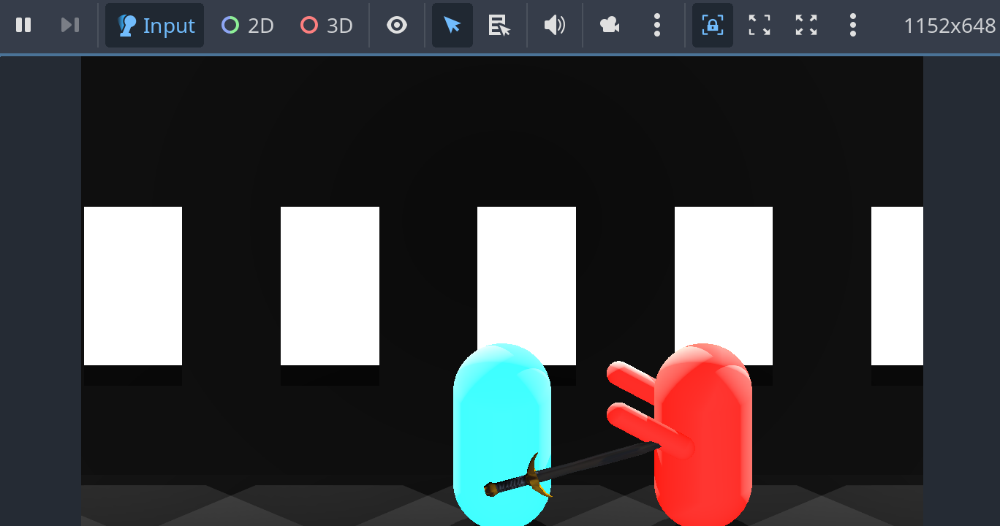
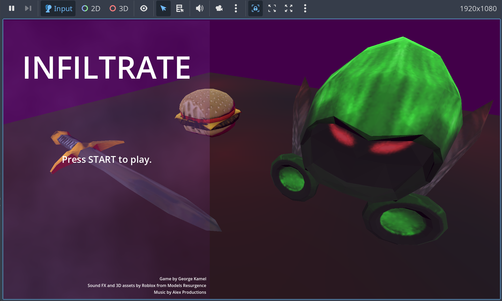

# Journal

This journal catalogs every step I took when working on this game and console.

## Week 1 - The Game ([view here](https://Jubillion.gihub.io/Infiltrate-Game/))

In week 1, I created the game in Godot, which I later put into the console.

### Jan 3, 2026

I created a general plan for the game, created the project, and followed every single one of the "Getting Started" Godot tutorials ([link here](https://docs.godotengine.org/en/stable/getting_started/introduction/index.html)). This took me the entire day (and even some of the next day). Here's what my projects screen looked like afterward:

> **Note:** none of this time was counted towards Hackatime, since I didn't enable the extension on any of those projects. Any time logged is solely spent working on this game.

### Jan 4, 2026

I finished the last tutorial and then began my game. I implemented some basic map generation, player movement, and enemy spawning. I plan on keeping the half-finished look of the game for the most part. It's easier to use and looks pretty good anyway.

I also figured out how to export it to the web, which is viewable [as a static webpage](https://Jubillion.github.io/Infiltrate-Game/jan_4/).

### Jan 5, 2026

I made a basic enemy attack/parry system, which will be the basis for all of the combat in the game.

Here's the link to [the game as of Jan 5](https://Jubillion.github.io/Infiltrate-Game/jan_5/).

The game looked like this with those changes:

### Jan 6 - 9, 2026

I took a (very long) break from working on the game to focus on a school project and have some time to myself in general. I continued working on Jan 10 and tried my best to make up for the time I lost during these days.

### Jan 10, 2026

I added hearts that heal the player and made the enemies flash when hitting you. I also added UI to the game, which made it seem a lot more "finished." I also added a few sound effects, but not all of the sound effects for the final game.

The game's Jan 10 version can be [played here](https://Jubillion.gihub.io/Infiltrate-Game/jan_10). I forgot to take a screensohot for this day, but you can try out the game and see how it was at that time.

### Jan 11, 2026

This is my final day of working on the game. I added lots of finishing touches, including more sounds, and added different enemy types. I also added a title screen, which doubles as a death screen since I was too lazy to make a death screen.

The game's final version is playaable at [the final demo site](https://Jubillion.gihub.io/Infiltrate-Game/), which redirects to the game's specific version. Below is a screenshot of the title screen.

