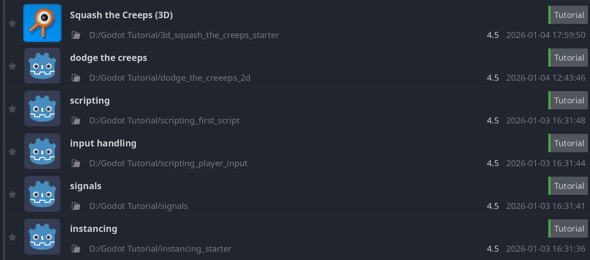

# Journal

This journal catalogs every step I took when working on this game and console.

## Week 1

In week 1, I created the game in Godot, which I later put into the console.

### Jan 3, 2025

I created a general plan for the game, created the project, and followed every single one of the "Getting Started" Godot tutorials ([link here](https://docs.godotengine.org/en/stable/getting_started/introduction/index.html)). This took me the entire day (and even some of the next day). Here's what my projects screen looked like afterward:

### Jan 4, 2025

I finished the last tutorial and then began my game. I implemented some basic map generation, player movement, and enemy spawning. I plan on keeping the half-finished look of the game for the most part. It's easier to use and looks pretty good anyway.

I also figured out how to export it to the web, which is viewable [as a static webpage](https://Jubillion.github.io/Infiltrate-Game/jan-4/).
